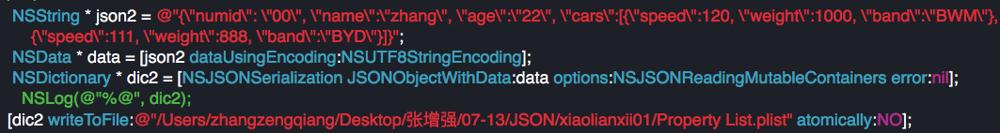
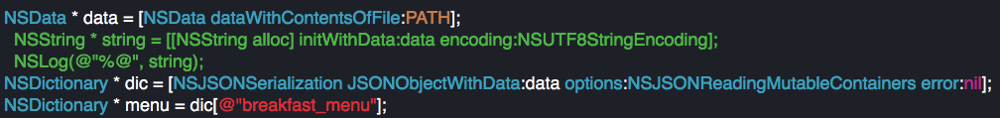
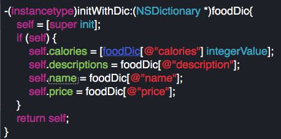

# 07-13
---
#JSON的使用
####JSON(JavaScript Object Notation) 是一种轻量级的数据交换格式。它基于JavaScript（Standard ECMA-262 3rd Edition - December 1999）的一个子集。 JSON采用完全独立于语言的文本格式，但是也使用了类似于C语言家族的习惯（包括C, OC,C++, C#, Java, JavaScript, Perl, Python等）。这些特性使JSON成为理想的数据交换语言。 易于人阅读和编写，同时也易于机器解析和生成(网络传输速度)。
####优点：适用于各种平台
---
##使用规则:
    •	数据在名称/值对中
	•	每一条数据由逗号分隔
	•	花括号保存对象   @{@“”:@“”} == {“”:””}
	•	方括号保存数组   @[@“one”,@“two”] == [“one”,”two”];
##JSON值:
###JSON 值可以是：
	•	数字（整数或浮点数）int  float
	•	字符串（在双引号中）””
	•	逻辑值（true 或 false）BOOL YES NO
	•	数组（在方括号中）
	•	对象（在花括号中）
	•	null（空）
##JSON的基本结构:
####Json的结构简单说就是javascript中的对象和数组，所以这两种结构就是对象和数组两种结构，通过这两种结构可以表示各种复杂的结构
| **1、字典：对象在js中表示为“{}”括起来的内容，数据结构为 {key：value,key：value,...}的键值对的结构，在面向对象的语言中，key为对象的属性，value为对应的属性值，所以很容易理 解，取值方法为 对象.key 获取属性值，这个属性值的类型可以是 数字、字符串、数组、对象几种。** |
| -- |
| **2、数组：数组在js中是中括号“[]”括起来的内容，数据结构为 [“jave”,”javascript","vb",...]，取值方式和所有语言中一样，使用索引获取，字段值的类型可以是 数字、字符串、数组、对象几种。** |
---
##简单的JSON书写
####通过NSString书写正确的书写格式，然后通过框架自带JSON解析的方法进行解析
```
NSDictionary * dic = @{@"01":@"zhang", @"02":@"wang"};
//        写json字符串时，可以有整型、逻辑型，但通过NSJSONSerialization转换成对象以后就没有了整型和逻辑型。
//        重点：要知道json字符串中的数据和转换成对象的数据是不完全一样的
        NSString * json = @"{\"01\":\"zhang\", \"02\":\"wang\"}";
        NSString * json2 = @"{\"01\":[\"zhang\", true], \"02\":[\"wang\", false]}";
        NSData * data = [json dataUsingEncoding:NSUTF8StringEncoding];
        NSData * data2 = [json2 dataUsingEncoding:NSUTF8StringEncoding];
        NSError * err = nil;
//        通过这种手段转换为我们需要的数据
        /*
         NSJSONReadingMutableContainers = (1UL << 0),会把json数据转换成可变的数组/字典
         NSJSONReadingMutableLeaves = (1UL << 1),会把json数据转换成不可变的数/字典      
         NSJSONReadingAllowFragments = (1UL << 2)，几乎没人用，作用吧json数据转换为非数组，但实际上并没有关系
         */
//        从数组或字典取出的元素可能是bool的吗？
//        不可能是bool的，因为数组或字典中存储的是对象
//        NSMutableDictionary * obj = [NSJSONSerialization JSONObjectWithData:data2 options:NSJSONReadingMutableLeaves error:&err];
        id * obj = [NSJSONSerialization JSONObjectWithData:data2 options:NSJSONReadingAllowFragments error:&err];
//        [obj setObject:@[@"li", @(false)] forKey:@"03"];
        NSLog(@"%@", obj);
        [obj writeToFile:PATH atomically:NO];
```
##把JSON写入对象

####通过字典或是数组接收数据
---
##把JSON写入类
####创建类，设定属性和方法，然后通过JSON文件获取。
####获取第一层数据

####主要的方法

###代码实现
#####main.m
```
#import <Foundation/Foundation.h>
#import "BreakfastMenu.h"
#import "Food.h"
#define PATH @"/Users/zhangzengqiang/Desktop/张增强/07-13/2016-07-13/resource/jsonFile/菜单Json"

int main(int argc, const char * argv[]) {
    @autoreleasepool {
        
        NSData * data = [NSData dataWithContentsOfFile:PATH];
//        NSString * string = [[NSString alloc] initWithData:data encoding:NSUTF8StringEncoding];
//        NSLog(@"%@", string);
        NSDictionary * dic = [NSJSONSerialization JSONObjectWithData:data options:NSJSONReadingMutableContainers error:nil];
        NSDictionary * menu = dic[@"breakfast_menu"];
//        NSLog(@"%@", menu);
        NSArray * arrayFoods = menu[@"food"];
//        NSLog(@"%@", arrayFoods);
        
        NSMutableArray * table = [NSMutableArray array];
        for (NSDictionary * di in arrayFoods) {
            Food * food = [[Food alloc] init];
            
//            food.calories = [di[@"calories"] integerValue];
//            food.descriptions = di[@"description"];
//            food.name = di[@"name"];
//            food.price = di[@"price"];
            
            [food initWithDic:di];
            [table addObject:food];
            [food release];
        }
        
        BreakfastMenu * fast = [[BreakfastMenu alloc] init];
        fast.foods = table;
        NSLog(@"%@", fast);
        [fast release];
    }
    return 0;
}
```
#####BreakfastMenu.h
```
#import <Foundation/Foundation.h>

@interface BreakfastMenu : NSObject

@property(nonatomic, strong)NSArray * foods;

@end
```
#####BreakfastMenu.m
```
#import "BreakfastMenu.h"

@implementation BreakfastMenu

- (NSString *)description
{
    return [NSString stringWithFormat:@"早餐菜单为: \n%@", self.foods];
}

- (void)dealloc
{
    NSLog(@"BreakfastMenu mu le");
    self.foods = nil;
    [super dealloc];
}
```
#####Food.h
```
#import <Foundation/Foundation.h>

@interface Food : NSObject

@property(nonatomic, assign)NSInteger calories;
@property(nonatomic, copy)NSString * descriptions;
@property(nonatomic, copy)NSString * name;
@property(nonatomic, copy)NSString * price;

-(instancetype)initWithDic:(NSDictionary *)foodDic;

@end
```
#####Food.m
```
#import "Food.h"

@implementation Food

-(instancetype)initWithDic:(NSDictionary *)foodDic{
    self = [super init];
    if (self) {
        self.calories = [foodDic[@"calories"] integerValue];
        self.descriptions = foodDic[@"description"];
        self.name = foodDic[@"name"];
        self.price = foodDic[@"price"];
    }
    return self;
}

- (NSString *)description
{
    return [NSString stringWithFormat:@"calories: %ld descriptions: %@ name: %@ price: %@", self.calories, self.descriptions, self.name, self.price];
}

- (void)dealloc
{
    NSLog(@"FOOD is sold......");
    [super dealloc];
}

@end
```
---
##通过网络请求数据
####步骤
    1、获取URL，通过NSURL
    2、通过NSData进行JSON的转换
    3、写入到类中
####代码展示——
#####main.m
```
#import <Foundation/Foundation.h>
#import "Application.h"
#define URL @"http://iappfree.candou.com:8080/free/applications/limited?currency=rmb&page=1&limit=20"
int main(int argc, const char * argv[]) {
    @autoreleasepool {
//        url ------ 统一资源定位符
        NSURL * url = [NSURL URLWithString:URL];
        NSData * data = [NSData dataWithContentsOfURL:url];
        NSDictionary * dic = [NSJSONSerialization JSONObjectWithData:data options:NSJSONReadingMutableContainers error:nil];
//        NSLog(@"%@", dic);
        NSMutableArray * result = [NSMutableArray array];
        NSArray * array = dic[@"applications"];
        for (NSDictionary * myDic in array) {
            Application * app = [[Application alloc] initWithDic:myDic];
            [result addObject:app];
        }
        NSLog(@"%@", result);
    }
    return 0;
}
```
#####Application.h
```
#import <Foundation/Foundation.h>

@interface Application : NSObject

@property(nonatomic, copy)NSString * applicationId;
@property(nonatomic, copy)NSString * slug;
@property(nonatomic, copy)NSString * name;
@property(nonatomic, copy)NSString * releaseDate;
@property(nonatomic, copy)NSString * version;
@property(nonatomic, copy)NSString * descript;
@property(nonatomic, assign)NSNumber * categoryId;
@property(nonatomic, copy)NSString * categoryName;
@property(nonatomic, copy)NSString * iconUrl;
@property(nonatomic, copy)NSString * itunesUrl;
@property(nonatomic, copy)NSString * starCurrent;
@property(nonatomic, copy)NSString * starOverall;
@property(nonatomic, copy)NSString * ratingOverall;
@property(nonatomic, copy)NSString * downloads;
@property(nonatomic, copy)NSString * currentPrice;
@property(nonatomic, copy)NSString * lastPrice;
@property(nonatomic, copy)NSString * priceTrend;
@property(nonatomic, copy)NSString * expireDatetime;
@property(nonatomic, copy)NSString * releaseNotes;
@property(nonatomic, copy)NSString * updateDate;
@property(nonatomic, copy)NSString * fileSize;
@property(nonatomic, copy)NSString * ipa;
@property(nonatomic, copy)NSString * shares;
@property(nonatomic, copy)NSString * favorites;

-(instancetype)initWithDic:(NSDictionary *)dic;

@end
```
####Application.m
```
#import "Application.h"

@implementation Application

- (instancetype)initWithDic:(NSDictionary *)dic
{
    self = [super init];
    if (self) {
//        KVC 赋值方式，在dic某一键值找不到对应的属性，那么就会调用setValue:forUndefinedKey: 并且会把找不到键值对的内容传过去
        [self setValuesForKeysWithDictionary:dic];
    }
    return self;
}

//在属性中找不到与字典中key匹配的属性就会调用此方法
-(void)setValue:(id)value forUndefinedKey:(NSString *)key{
    
    if([key isEqualToString:@"description"]){
        self.descript = value;
    }
}

- (NSString *)description
{
    return [NSString stringWithFormat:@"applicationId %@", self.applicationId];
}

@end
```
###注：
####当定义属性的时候，要是属性名与系统的关键字冲突的时候，要写上
    -(void)setValue:(id)value forUndefinedKey:(NSString *)key
####并且重新赋值——
    if([key isEqualToString:@"description"]){
        self.descript = value;
    }

