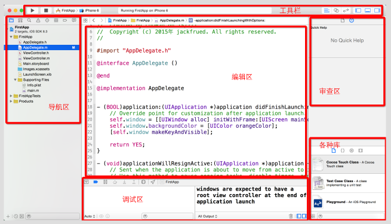
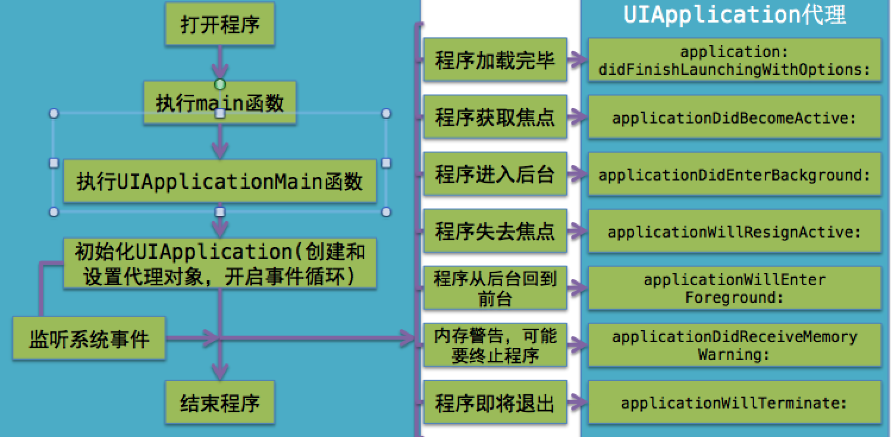
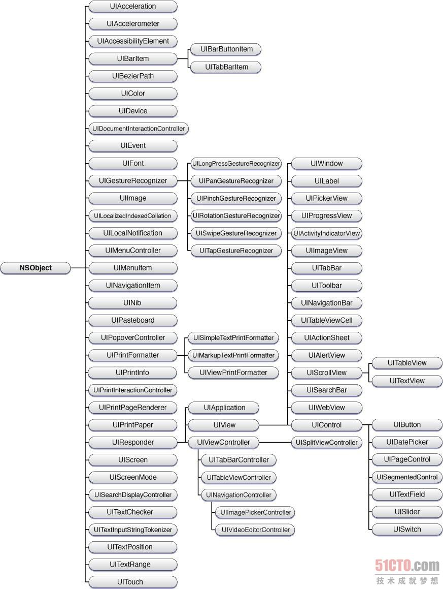

# UILabel学习

---

## XCode的页面布局



## 一个应用的声明周期



## 继承关系图



## iOS屏幕坐标系

> iPhone 4 , 4s, 3.5寸
> 屏幕分辨率  （640 \* 960 ）  （0，0） （320，480） 宽320，高480
> 
> iPone5, 5c, 5s, 4寸
> 屏幕分辨率 （640 \* 1136）  （0，0） （320，568）宽 320 高568
> 
> iPhone 6         4.7寸
> 屏幕分辨率 （750 \*1334）   （0，0） （375，667）宽 375   高667
> 
> iPhone 6 Plus  5.5寸
>  屏幕分辨率（1242 \*2208） （0，0） （414，736） 宽 414 高736

## UILable的使用

#### 创建一个label

```
 UILabel * label1 = [[UILabel
alloc]initWithFrame:CGRectMake(0, 0, 320, 30)];
```

#### 把Label添加到视图

```
 [self.view addSubview:label1];
```

#### 设置label内容

```
 label2.text =@"hi,我是 个标签. ";
```

#### 设置内容颜色

```
 label2.textColor = [UIColor whiteColor];
```

#### 设置标签背景颜色

```
 label.backgroundColor = [UIColor
orangeColor];
```

#### 设置字体大小

```
 label.font = [UIFont systemFontOfSize:40]; label.font = [UIFont boldSystemFontOfSize:20];//加粗
label.font = [UIFont italicSystemFontOfSize:20];//倾斜
```

#### 自适应宽度

```
 label.adjustsFontSizeToFitWidth = YES;
```

#### 对齐方式

```
 //    对齐
//    自然对齐
    label.textAlignment = NSTextAlignmentNatural;
//    右对齐
    label.textAlignment = NSTextAlignmentRight;
//    左对齐
    label.textAlignment = NSTextAlignmentLeft;
//    居中对齐
    label.textAlignment = NSTextAlignmentCenter;
//    在一个段落的最后一行自然对齐
    label.textAlignment = NSTextAlignmentJustified;
```

#### 换行方式

```
 //    调整显示行数. 注：如果设置的是具体多少行，就是多少行。如果写0，那么是表示多行显示。
    label.numberOfLines = 0;
    /*
     以单词为单位进行换行，多余的单词不显示
     NSLineBreakByWordWrapping = 0,         // Wrap at word boundaries, default
     以字符为单位进行换行，多余的单词不显示
     NSLineBreakByCharWrapping,        // Wrap at character boundaries
     切除尾部内容，简单的换行方式，除最后一行都是以单词为单位进行换行，最后一行能显示多少显示多少
     NSLineBreakByClipping,        // Simply clip
     最后一行 前半部分不显示
     NSLineBreakByTruncatingHead,    // Truncate at head of line: "...wxyz"
     最后一行 后半部分不显示
     NSLineBreakByTruncatingTail,    // Truncate at tail of line: "abcd..."
     中间不显示
     NSLineBreakByTruncatingMiddle    // Truncate middle of line:  "ab...yz"
     */
```

#### 阴影

```
 label.shadowOffset = CGSizeMake(3, 5);
 label.shadowColor = [UIColor blackColor];
```

#### 圆角

```
label.layer.borderColor = [[UIColor whiteColor] CGColor];
label.layer.borderWidth = 3.0;
label.layer.cornerRadius = 10;
//    超过的内容会切除掉
label.clipsToBounds = YES;
```

