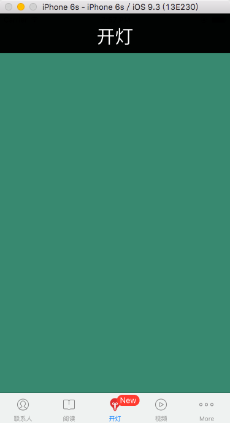
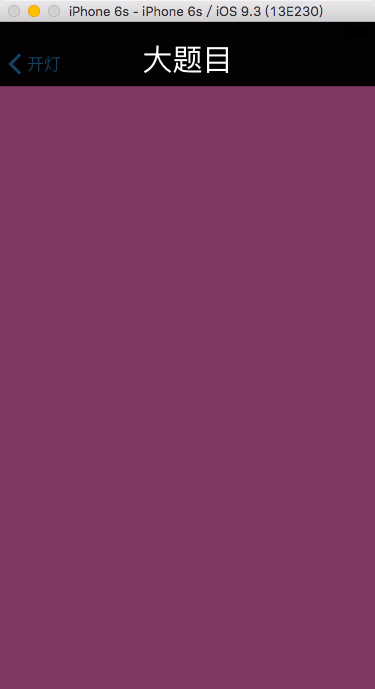
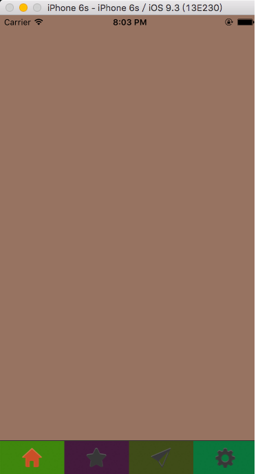

# NSUserDefaults 和UITabbarController

---

## NSUserDefaults

> 注意事项：
> 
> > 1、是一个单例
> > 
> > 2、存储的内容实在一个plist文件中
> > 
> > 通过`NSHomeDirectory()`方法就能够打印出当前工程的路径。
> > 
> > 
> > 
> > 3、内容删除一次之后，如果没有再存，那么就没有了

##### 代码实现

```
// NSUserDefaults是个单例
 // 可以持久化数据
 NSUserDefaults * userDefaults = [NSUserDefaults standardUserDefaults];
 // NSLog(@"%@", userDefaults);
 // 把一个数据存储起来
 NSLog(@"%@", [userDefaults objectForKey:@"array"]);
 NSLog(@"%ld", [userDefaults integerForKey:@"value"]);

 // 删除一次就没了。通过key删除内容
 [userDefaults removeObjectForKey:@"array"];
```

##### 利用代理传值

###### ViewController.m

```
- (void)viewDidLoad {
 [super viewDidLoad];
 // Do any additional setup after loading the view, typically from a nib.

 self.view.backgroundColor = [UIColor colorWithRed:arc4random()%255/255.0 green:arc4random()%255/255.0 blue:arc4random()%255/255.0 alpha:0.5];

// 补充：
 AppDelegate * appD = [UIApplication sharedApplication].delegate;
 appD.name = @"zhang";
 NSLog(@"%@", appD.name);

}

-(void)viewWillAppear:(BOOL)animated{
 AppDelegate * appD = [UIApplication sharedApplication].delegate;
 appD.name = @"zhang";
 NSLog(@"viewWillAppear %@", appD.name);
}

//-(void)viewWillDisappear:(BOOL)animated{
// AppDelegate * appD = [UIApplication sharedApplication].delegate;
// appD.name = @"zhang";
// NSLog(@"viewWillDisappear %@", appD.name);
//}


-(void)touchesBegan:(NSSet<UITouch *> *)touches withEvent:(UIEvent *)event{
 AViewController * avc = [[AViewController alloc] init];
 [self presentViewController:avc animated:YES completion:nil];
}

-(void)test{
 // NSUserDefaults是个单例
 // 可以持久化数据
 NSUserDefaults * userDefaults = [NSUserDefaults standardUserDefaults];
 // NSLog(@"%@", userDefaults);
 // 把一个数据存储起来
 NSLog(@"%@", [userDefaults objectForKey:@"array"]);
 NSLog(@"%ld", [userDefaults integerForKey:@"value"]);

 // 删除一次就没了。通过key删除内容
 [userDefaults removeObjectForKey:@"array"];

}

- (void)didReceiveMemoryWarning {
 [super didReceiveMemoryWarning];
 // Dispose of any resources that can be recreated.
}
```

###### AViewController.m

```
- (void)viewDidLoad {
 [super viewDidLoad];
 // Do any additional setup after loading the view.
 self.view.backgroundColor = [UIColor colorWithRed:arc4random()%255/255.0 green:arc4random()%255/255.0 blue:arc4random()%255/255.0 alpha:0.5];

 AppDelegate * appD = [UIApplication sharedApplication].delegate;

 NSLog(@"AViewController %@", appD.name);

 appD.name = @"wang";
}


-(void)touchesBegan:(NSSet<UITouch *> *)touches withEvent:(UIEvent *)event{
 [self dismissViewControllerAnimated:YES completion:nil];
}

- (void)didReceiveMemoryWarning {
 [super didReceiveMemoryWarning];
 // Dispose of any resources that can be recreated.
}
```

###### 注意：

> 在传值的时候，要注意值输出和修改的位置。

---

## UITabbarController

### 功能

```
UITabbarController创建的是一个底部的工具栏
```

### 创建

> 创建对象
> 
> > UITabBarController \* tabBarController = \[\[UITabBarController alloc\] init\]; 
> >  self.window.rootViewController = tabBarController;
> 
> 创建导航控制栏
> 
> > ViewController \* vc = \[\[ViewController alloc\] init\];

### 页面添加

> 创建多个继承于 UIViewController 的视图

```
 AViewController * avc = [[AViewController alloc] init]; 
 // [tabBarController addChildViewController:avc];
 avc.tabBarItem.image = [[UIImage imageNamed:@"tabbar_icon_me_normal@2x"] imageWithRenderingMode:UIImageRenderingModeAlwaysOriginal];
 avc.tabBarItem.selectedImage = [[UIImage imageNamed:@"tabbar_icon_me_highlight@2x"] imageWithRenderingMode:UIImageRenderingModeAlwaysOriginal];
 avc.title = @"好友";
 BViewController * bvc = [[BViewController alloc] init];
 // [tabBarController addChildViewController:bvc];
 bvc.tabBarItem.image = [[UIImage imageNamed:@"tabbar_icon_news_normal@2x"] imageWithRenderingMode:UIImageRenderingModeAlwaysOriginal];
 bvc.tabBarItem.selectedImage = [[UIImage imageNamed:@"tabbar_icon_news_highlight@2x"] imageWithRenderingMode:UIImageRenderingModeAlwaysOriginal];
 bvc.title = @"新闻";
 CViewController * cvc = [[CViewController alloc]init];
 cvc.tabBarItem.image = [[UIImage imageNamed:@"tabbar_icon_media_normal@2x"] imageWithRenderingMode:UIImageRenderingModeAlwaysOriginal];
 cvc.tabBarItem.selectedImage = [[UIImage imageNamed:@"tabbar_icon_media_highlight@2x"] imageWithRenderingMode:UIImageRenderingModeAlwaysOriginal];
 cvc.title = @"视频";
 DViewController * dvc = [[DViewController alloc]init];
 dvc.tabBarItem.image = [[UIImage imageNamed:@"tabbar_icon_reader_normal@2x"] imageWithRenderingMode:UIImageRenderingModeAlwaysOriginal];
 dvc.tabBarItem.selectedImage = [[UIImage imageNamed:@"tabbar_icon_reader_highlight@2x"] imageWithRenderingMode:UIImageRenderingModeAlwaysOriginal];
 dvc.title = @"阅读";
 EViewController * evc = [[EViewController alloc]init];
 evc.tabBarItem.image = [[UIImage imageNamed:@"tabbar_icon_me_normal@2x"] imageWithRenderingMode:UIImageRenderingModeAlwaysOriginal];
 evc.tabBarItem.selectedImage = [[UIImage imageNamed:@"tabbar_icon_me_highlight@2x"] imageWithRenderingMode:UIImageRenderingModeAlwaysOriginal];
 evc.title = @"联系人";
```

### 创建联系

> 创建数组
> 
> > NSArray \* viewControllersArray = @\[nvc, avc,bvc,cvc,dvc,evc\];
> 
> 添加view视图
> 
> > tabBarController.viewControllers = viewControllersArray;

### 修改属性

###### TabBar的属性

> 背景颜色
> 
> > \[UITabBar appearance\].barTintColor = \[UIColor orangeColor\];
> 
> 设置默认背景图片
> 
> > nvc.tabBarItem.image = \[\[UIImage imageNamed:@"tabbar\_icon\_found\_normal@2x"\] imageWithRenderingMode:UIImageRenderingModeAlwaysOriginal\];
> 
> 设置选中状态下的图片背景
> 
> > nvc.tabBarItem.selectedImage = \[\[UIImage imageNamed:@"tabbar\_icon\_found\_highlight@2x"\] imageWithRenderingMode:UIImageRenderingModeAlwaysOriginal\];
> 
> 设置tabBar的title
> 
> > nvc.title = @"开灯";
> 
> 设置背景图片与边界的距离
> 
> > vc.tabBarItem.imageInsets = UIEdgeInsetsMake\(0, 0, -10, -20\);
> 
> 显示消息内容
> 
> > nvc.tabBarItem.badgeValue = @"New";
> 
> 设置详细页面中对于底部的tabBar隐藏
> 
> > `-(void)touchesBegan:(NSSet<UITouch *> *)touches withEvent:(UIEvent *)event{ 
> >  DetilaViewController * detailVC = [[DetilaViewController alloc] init];
> >  [self.navigationController pushViewController:detailVC animated:YES];
> > }`

###### UINavigationController 属性

> 返回按钮处的字体颜色
> 
> > `[UINavigationBar appearance].tintColor = [UIColor colorWithRed:arc4random()%255/255.0 green:arc4random()%255/255.0 blue:arc4random()%255/255.0 alpha:0.5];`
> 
> 标题颜色设置
> 
> > `[UINavigationBar appearance].titleTextAttributes = @{NSFontAttributeName:[UIFont systemFontOfSize:30], NSForegroundColorAttributeName:[UIColor whiteColor]};`
> 
> 背景色
> 
> > `[UINavigationBar appearance].barTintColor = [UIColor blackColor];`
> 
> 默认启动选择的按钮（ 注意位置在添加bar之后 ）
> 
> > tabBarController.selectedIndex = 2;

### 利用数据持久化，让每次打开tabbar的时候，下面按钮的位置与上次自定义过后的位置相同

##### 1、先存储内容

```
- (void)tabBarController:(UITabBarController *)tabBarController willEndCustomizingViewControllers:(NSArray<__kindof UIViewController *> *)viewControllers changed:(BOOL)changed {
 NSLog(@"编辑将要结束 %@", viewControllers);
 // 把新的顺序存储起来
 NSMutableArray * vctitles = [NSMutableArray array];
 for (UIViewController * vc in viewControllers) {
 [vctitles addObject:vc.tabBarItem.title];
 }
 NSUserDefaults * userDefaults = [NSUserDefaults standardUserDefaults];
 [userDefaults setObject:vctitles forKey:@"order"];
 [userDefaults synchronize];
 NSLog(@"%@", NSHomeDirectory());
}
```

##### 2、拿出来，遍历排序

```
把记录好的tabBarController上的item写上
 NSArray * viewControllersArray = @[nvc, avc,bvc,cvc,dvc,evc];
 NSUserDefaults * userDefaults = [NSUserDefaults standardUserDefaults];
 NSArray * titlesArray = [userDefaults arrayForKey:@"order"];
 NSMutableArray * tmpArray = [NSMutableArray array];
 if (titlesArray.count == 0) {
 tabBarController.viewControllers = viewControllersArray;
 }else{
 for (NSString * title in titlesArray) {
 for (UIViewController * vc in viewControllersArray) {
 if ([vc.tabBarItem.title isEqualToString: title]) {
 [tmpArray addObject:vc];
 }
 }
 }
 tabBarController.viewControllers = tmpArray;
 }
```

###### 完整代码

```
@implementation AppDelegate


- (BOOL)application:(UIApplication *)application didFinishLaunchingWithOptions:(NSDictionary *)launchOptions {
 // Override point for customization after application launch.

 self.window = [[UIWindow alloc] initWithFrame:[UIScreen mainScreen].bounds];
 self.window.backgroundColor = [UIColor colorWithRed:arc4random()%255/255.0 green:arc4random()%255/255.0 blue:arc4random()%255/255.0 alpha:0.5];

 // 添加rootviewController
 [self createRootViewController];

 [self.window makeKeyAndVisible];

 return YES;
}

-(void)createRootViewController{
 // 下面的TabBar的控制器
 UITabBarController * tabBarController = [[UITabBarController alloc] init];
 self.window.rootViewController = tabBarController;
 // 这个设置不起作用
// [UITabBar appearance].backgroundColor = [UIColor colorWithRed:arc4random()%255/255.0 green:arc4random()%255/255.0 blue:arc4random()%255/255.0 alpha:0.5];

// 下边控制器变色
// [UITabBar appearance].barTintColor = [UIColor orangeColor];


// 设置导航控制栏
 ViewController * vc = [[ViewController alloc] init];
 UINavigationController * nvc = [[UINavigationController alloc] initWithRootViewController:vc];

// 返回字体的颜色,左边返回按钮
 [UINavigationBar appearance].tintColor = [UIColor colorWithRed:arc4random()%255/255.0 green:arc4random()%255/255.0 blue:arc4random()%255/255.0 alpha:0.5];
 // [tabBarController addChildViewController:vc];

// 标题的颜色
 [UINavigationBar appearance].titleTextAttributes = @{NSFontAttributeName:[UIFont systemFontOfSize:30], NSForegroundColorAttributeName:[UIColor whiteColor]};

 [UINavigationBar appearance].barTintColor = [UIColor blackColor];


 nvc.tabBarItem.image = [[UIImage imageNamed:@"tabbar_icon_found_normal@2x"] imageWithRenderingMode:UIImageRenderingModeAlwaysOriginal];
 nvc.tabBarItem.selectedImage = [[UIImage imageNamed:@"tabbar_icon_found_highlight@2x"] imageWithRenderingMode:UIImageRenderingModeAlwaysOriginal];
 nvc.title = @"开灯";
 // 图片距边界距离
 // vc.tabBarItem.imageInsets = UIEdgeInsetsMake(0, 0, -10, -20);
 // 显示消息数量。提示,可写汉字
 nvc.tabBarItem.badgeValue = @"New";


 AViewController * avc = [[AViewController alloc] init];
 // [tabBarController addChildViewController:avc];
 avc.tabBarItem.image = [[UIImage imageNamed:@"tabbar_icon_me_normal@2x"] imageWithRenderingMode:UIImageRenderingModeAlwaysOriginal];
 avc.tabBarItem.selectedImage = [[UIImage imageNamed:@"tabbar_icon_me_highlight@2x"] imageWithRenderingMode:UIImageRenderingModeAlwaysOriginal];
 avc.title = @"好友";

 BViewController * bvc = [[BViewController alloc] init];
 // [tabBarController addChildViewController:bvc];
 bvc.tabBarItem.image = [[UIImage imageNamed:@"tabbar_icon_news_normal@2x"] imageWithRenderingMode:UIImageRenderingModeAlwaysOriginal];
 bvc.tabBarItem.selectedImage = [[UIImage imageNamed:@"tabbar_icon_news_highlight@2x"] imageWithRenderingMode:UIImageRenderingModeAlwaysOriginal];
 bvc.title = @"新闻";

 CViewController * cvc = [[CViewController alloc]init];
 cvc.tabBarItem.image = [[UIImage imageNamed:@"tabbar_icon_media_normal@2x"] imageWithRenderingMode:UIImageRenderingModeAlwaysOriginal];
 cvc.tabBarItem.selectedImage = [[UIImage imageNamed:@"tabbar_icon_media_highlight@2x"] imageWithRenderingMode:UIImageRenderingModeAlwaysOriginal];
 cvc.title = @"视频";

 DViewController * dvc = [[DViewController alloc]init];
 dvc.tabBarItem.image = [[UIImage imageNamed:@"tabbar_icon_reader_normal@2x"] imageWithRenderingMode:UIImageRenderingModeAlwaysOriginal];
 dvc.tabBarItem.selectedImage = [[UIImage imageNamed:@"tabbar_icon_reader_highlight@2x"] imageWithRenderingMode:UIImageRenderingModeAlwaysOriginal];
 dvc.title = @"阅读";

 EViewController * evc = [[EViewController alloc]init];
 evc.tabBarItem.image = [[UIImage imageNamed:@"tabbar_icon_me_normal@2x"] imageWithRenderingMode:UIImageRenderingModeAlwaysOriginal];
 evc.tabBarItem.selectedImage = [[UIImage imageNamed:@"tabbar_icon_me_highlight@2x"] imageWithRenderingMode:UIImageRenderingModeAlwaysOriginal];
 evc.title = @"联系人";

// FViewController * fvc = [[FViewController alloc]init];

 // 宽度,不起作用
 tabBarController.tabBar.itemWidth = -1150;
 // 中间的空格，不起作用
 tabBarController.tabBar.itemSpacing = -1000;
 /*
 UITabBarItemPositioningAutomatic,
 UITabBarItemPositioningFill,
 UITabBarItemPositioningCentered,
 */
 // 位置
 tabBarController.tabBar.itemPositioning = UITabBarItemPositioningCentered;

 // 启动时默认显示哪个视图，注意位置在添加bar之后
 tabBarController.selectedIndex = 2;

 //创建一个UITabBarItem
 UITabBarItem * viewTabBar = [[UITabBarItem alloc] initWithTitle:@"我是谁" image:[[UIImage imageNamed:@"tabbar_icon_found_normal@2x"] imageWithRenderingMode:UIImageRenderingModeAlwaysOriginal] tag:100];
 // 自己创建的UITabBarItem同样可以设置属性
 viewTabBar.selectedImage = [[UIImage imageNamed:@"tabbar_icon_found_highlight@2x"] imageWithRenderingMode:UIImageRenderingModeAlwaysOriginal];
 // 创建好的要放在view的tabBarItem中
 avc.tabBarItem = viewTabBar;

// 把记录好的tabBarController上的item写上
 NSArray * viewControllersArray = @[nvc, avc,bvc,cvc,dvc,evc];
 NSUserDefaults * userDefaults = [NSUserDefaults standardUserDefaults];
 NSArray * titlesArray = [userDefaults arrayForKey:@"order"];
 NSMutableArray * tmpArray = [NSMutableArray array];
 if (titlesArray.count == 0) {
 tabBarController.viewControllers = viewControllersArray;
 }else{
 for (NSString * title in titlesArray) {
 for (UIViewController * vc in viewControllersArray) {
 if ([vc.tabBarItem.title isEqualToString: title]) {
 [tmpArray addObject:vc];
 }
 }
 }
 tabBarController.viewControllers = tmpArray;
 }


 // 代理
 tabBarController.delegate = self;


 self.window.rootViewController = tabBarController;
}

#pragma mark
#pragma mark ========= 协议

- (void)tabBarController:(UITabBarController *)tabBarController didSelectViewController:(UIViewController *)viewController{
 // 获取选中的viewController的tabBarItem的title
 // NSLog(@"%@", viewController.tabBarItem.title);

 // NSLog(@"%@", tabBarController.viewControllers);
 // 通过点击对象获取点击对象的下标
 // NSLog(@"%ld", [tabBarController.viewControllers indexOfObject:viewController]);
}

//将要编辑的时候会调用这个方法
- (void)tabBarController:(UITabBarController *)tabBarController willBeginCustomizingViewControllers:(NSArray<__kindof UIViewController *> *)viewControllers {
 NSLog(@"将要编辑 %@", viewControllers);


}
//编辑将要结束
- (void)tabBarController:(UITabBarController *)tabBarController willEndCustomizingViewControllers:(NSArray<__kindof UIViewController *> *)viewControllers changed:(BOOL)changed {
 NSLog(@"编辑将要结束 %@", viewControllers);
 // 把新的顺序存储起来
 NSMutableArray * vctitles = [NSMutableArray array];
 for (UIViewController * vc in viewControllers) {
 [vctitles addObject:vc.tabBarItem.title];
 }
 NSUserDefaults * userDefaults = [NSUserDefaults standardUserDefaults];
 [userDefaults setObject:vctitles forKey:@"order"];
 [userDefaults synchronize];
 NSLog(@"%@", NSHomeDirectory());
}
//
- (void)tabBarController:(UITabBarController *)tabBarController didEndCustomizingViewControllers:(NSArray<__kindof UIViewController *> *)viewControllers changed:(BOOL)changed{

}
- (void)applicationWillResignActive:(UIApplication *)application {
 // Sent when the application is about to move from active to inactive state. This can occur for certain types of temporary interruptions (such as an incoming phone call or SMS message) or when the user quits the application and it begins the transition to the background state.
 // Use this method to pause ongoing tasks, disable timers, and throttle down OpenGL ES frame rates. Games should use this method to pause the game.
}

- (void)applicationDidEnterBackground:(UIApplication *)application {
 // Use this method to release shared resources, save user data, invalidate timers, and store enough application state information to restore your application to its current state in case it is terminated later.
 // If your application supports background execution, this method is called instead of applicationWillTerminate: when the user quits.
}

- (void)applicationWillEnterForeground:(UIApplication *)application {
 // Called as part of the transition from the background to the inactive state; here you can undo many of the changes made on entering the background.
}

- (void)applicationDidBecomeActive:(UIApplication *)application {
 // Restart any tasks that were paused (or not yet started) while the application was inactive. If the application was previously in the background, optionally refresh the user interface.
 // 获取系统的空间的大小可以在这里打印
 // tabBar高度49
 UITabBarController * tbVC = (UITabBarController *)self.window.rootViewController;
 NSLog(@"%@", tbVC.tabBar);
}

- (void)applicationWillTerminate:(UIApplication *)application {
 // Called when the application is about to terminate. Save data if appropriate. See also applicationDidEnterBackground:.
}

@end
```

###### 效果图





### 自定义

##### 自定义一个tabBar

```
//创建一个UITabBarItem
 UITabBarItem * viewTabBar = [[UITabBarItem alloc] initWithTitle:@"我是谁" image:[[UIImage imageNamed:@"tabbar_icon_found_normal@2x"] imageWithRenderingMode:UIImageRenderingModeAlwaysOriginal] tag:100];
 // 自己创建的UITabBarItem同样可以设置属性
 viewTabBar.selectedImage = [[UIImage imageNamed:@"tabbar_icon_found_highlight@2x"] imageWithRenderingMode:UIImageRenderingModeAlwaysOriginal];
 // 创建好的要放在view的tabBarItem中
 avc.tabBarItem = viewTabBar;
```

##### 自定义一个底部导航栏

###### 1、创建继承于 UITabBarController 的类

###### 2、隐藏系统默认的导航栏

###### 3、写实现方法

###### 具体代码

> CustomerViewController.h

```
#import <UIKit/UIKit.h>

@interface CustomerViewController : UITabBarController

-(void)addViewControllers:(NSArray<UIViewController *> *) array;

-(void)setShowIndex:(NSInteger)index;

-(void)addViewController:(UIViewController *)vc;

@end
```

> CustomerViewController.m

```
#import "CustomerViewController.h"

@interface CustomerViewController ()

@property(nonatomic, strong)NSMutableArray<UIButton *>* btns;

@property(nonatomic, strong)NSMutableArray<UIViewController *>* VCS;

@end

@implementation CustomerViewController

- (instancetype)init
{
 self = [super init];
 if (self) {
 self.btns = [NSMutableArray array];
 }
 return self;
}

- (void)viewDidLoad {
 [super viewDidLoad];
 // Do any additional setup after loading the view.
 self.btns = [NSMutableArray array];
 self.VCS = [NSMutableArray array];
 [self hiddenTabBar];
}

//隐藏系统的tabBar
-(void)hiddenTabBar{
 self.tabBar.hidden = YES;
}

//通过数组添加UIViewController
-(void)addViewControllers:(NSArray<UIViewController *> *)array{
 [self clearScreenAndDate];

 [self hiddenTabBar];

 [self.VCS addObjectsFromArray:array];

 self.viewControllers = self.VCS;

 [self showTabBarViewControllers:self.VCS];

}

//添加单个的viewController
-(void)addViewController:(UIViewController *)vc{
 [self clearScreenAndDate];

 [self.VCS addObject:vc];

 self.viewControllers = self.VCS;
 [self showTabBarViewControllers:self.VCS];
}

-(void)clearScreenAndDate{
 [self.btns removeAllObjects];
 for (UIView * view in [self.view subviews]) {
 if ([view isKindOfClass:[UIImageView class]]) {
 [view removeFromSuperview];
 }
 }
}

//显示tabbar
-(void)showTabBarViewControllers:(NSArray<UIViewController *> *)array{
// [self clearScreenAndDate];

 float screenWidth = CGRectGetWidth(self.view.frame);
 float sceenHeight = CGRectGetHeight(self.view.frame);
 UIImageView * imageView = [[UIImageView alloc] initWithImage:[UIImage imageNamed:@"tabbg"]];
 imageView.frame = CGRectMake(0, sceenHeight-49, screenWidth, 49);
 [self.view addSubview:imageView];

 NSArray * btnImages = @[@"tab_0", @"tab_1", @"tab_2", @"tab_3"];
 NSArray * btnImagesH = @[@"tab_c0", @"tab_c1", @"tab_c2", @"tab_c3"];

 float btnWidth = screenWidth/array.count;
 for (NSInteger i = 0; i < array.count; i++) {

 UIButton * btn = [[UIButton alloc] initWithFrame:CGRectMake(i*btnWidth, 1, btnWidth, 48)];
 btn.backgroundColor = [UIColor colorWithRed:arc4random()%255/255.0 green:arc4random()%255/255.0 blue:arc4random()%255/255.0 alpha:0.5];


 [btn setImage:[UIImage imageNamed:btnImages[i]] forState:UIControlStateNormal];
 [btn setImage:[UIImage imageNamed:btnImagesH[i]] forState:UIControlStateSelected];

 btn.tag = 100 + i;
 [btn addTarget:self action:@selector(onClick:) forControlEvents:UIControlEventTouchUpInside];
 // 修改图片在Button中的位置
 btn.imageEdgeInsets = UIEdgeInsetsMake(-1, -1, -1, -1);
 // btn.selected = YES;

 [imageView addSubview:btn];
 [self.btns addObject:btn];
 imageView.userInteractionEnabled = YES;
 }

 // 要把View添加到tabBarController上
// self.viewControllers = array;
 self.btns[0].selected = YES;
}

-(void)onClick:(UIButton *)btn{
 [self cleatSelectedBtn];
 btn.selected = YES;

 self.selectedIndex = [self.btns indexOfObject:btn];
}

-(void)cleatSelectedBtn{
 for (UIButton * button in self.btns) {
 button.selected = NO;
 }
}

-(void)setShowIndex:(NSInteger)index{
 if(index < self.btns.count){
 [self cleatSelectedBtn];
 self.btns[index].selected = YES;
 self.selectedIndex = index;
 }
}

- (void)didReceiveMemoryWarning {
 [super didReceiveMemoryWarning];
 // Dispose of any resources that can be recreated.
}
@End
```

###### 效果图



