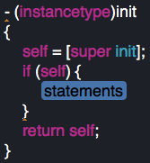

# OC-流程
---
##类与对象
###类
>类和对象：
 * 1.从生活的角度理解：
 *      >人： 张增强
 *      >水杯： xx的水杯
 * 2.封装：
 *      >【结构体】 是对数据存储的封装
 *      >【函数】 是对数据处理的封装
 *      >【类】 是对数据存储和处理的封装
 * 3.代码：
 *      >类相当于自定义的类型
 *      >对象
 * NSObject 是所有类的直接或者间接父类，也叫根类
###函数
>函数声明
>>函数声明格式： -(返回值类型) 标签名:(参数类型) 形参名;
>>
>>成员方法，对象方法，OC特殊叫法是——消息。
>>
>>在main.m中可以import ""多个类。
#####注意——
```
//        OC对象不存在栈区，只能声明在堆区
//        [Person alloc] 作用是开辟一个对象大小的空间，并返回对象的地址
        Person *person = [Person alloc];
//        person是对象指针，或者引用
//        在外部函数（main）中对象不可以访问成员变量， 或者是没有开发相应的权限
//        OC调用对象方法比较特殊：格式  [对象名 方法名:参数];
        [person setAge:20];
//        通过对象指针，给对象发送消息
//        对象指针调用对象方法
        [person setHeight:130];
        [person setAge:22 height:180];
        [person show];
```

---

##构造方法
###格式
>构造方法
>
>>格式：-（类名*）init;  作用是初始化对象。
>>
>>凡是以init开头的都是构造方法。（规范）。
>
>驼峰命名法
 *  1、类名或者工程名，所有单词的首字母大写。
 *  2、变量名或者函数名，除首单词首字母小写其余所有的单词首字母大写



---
##类方法
###定义
>类方法
>
>这个方法是属于类的，不是具体对象的方法
>
>类方法都是以"+"开头,"-"是对象方法
>
>类方法可以和对象方法重名

###重点
>重点：
>
>>1.类方法不可以直接访问，成员变量。
>>
>>2.类方法中不可以调用对象方法
>>
>>原因是没有对象。

###类方法作用
>类方法的作用
 * 1.简洁的创建一个对象
 * 2.创建一个简洁的对外接口
 * 3.创建单例模式
 * 我们有一种对象，它存储的数据为整个工程，每个文件每个函数所共享。这样便于对象之间传递数据，共享数据

###单例模式
#####main.h
```
#import <Foundation/Foundation.h>
#import "Dog.h"

void test(){
    Dog *dog = [Dog defaultDog];
    NSLog(@"test = %@ %p", [dog name],dog);
    [dog setName:@"xiaohong"];
}

int main(int argc, const char * argv[]) {
    @autoreleasepool {
        Dog *dog2 = [Dog defaultDog];
        [dog2 setName:@"dahuang"];
        NSLog(@"first = %@ %p",[dog2 name], dog2);
        
        test();
        NSLog(@"second = %@ %p",[dog2 name], dog2);
    }
    return 0;
}
```
#####Singleton.h
```
#import <Foundation/Foundation.h>

@interface Dog : NSObject
{
    NSString *_name;
}

//-(Dog*)init;
//单例命名一般都是以 default 或是 share 的开头.
+(Dog*)defaultDog;
-(void)setName:(NSString *)name;
-(NSString *)name;

@end
```
#####Singleton.
```
#import "Dog.h"

//static 只初始化一次，有一个对其更改，就会变化
@implementation Dog
//*
+(Dog *)defaultDog{
//    确保dog只会被创建一次
    static Dog *dog = nil;
    @synchronized(dog){//加入线程同步
    if (dog == nil) {
        dog = [[Dog alloc] init];
    }
 }
    return dog;
}

 //*/
//单例不是完整的
/*
+(Dog *)defaultDog{
    static Dog *dog = nil;
    static dispatch_once_t onceToken;
        dispatch_once(&onceToken, ^{
            dog = [[Dog alloc]init];
        });
    return dog;
}
 */
-(void)setName:(NSString *)name{
    _name = name;
}

-(NSString *)name{
    return _name;
}

@end
```
---
##数组
###数组分为可变数组NSMutableArray和不可变数组NSArray
>不可变数组
>
>>* 可以存储不同类对象，用isKindOfClass判断类别
>>
>>* 打印一个对象，其实是打印的对象description方法的返回值
>>
>>* 让数组中存储相同的类型的对象 NSArray<NSString*>
>>
>>* 数组中可以用三种遍历，for、forin、enumerateObjectsUsingBlock

>可变数组
>>
>>