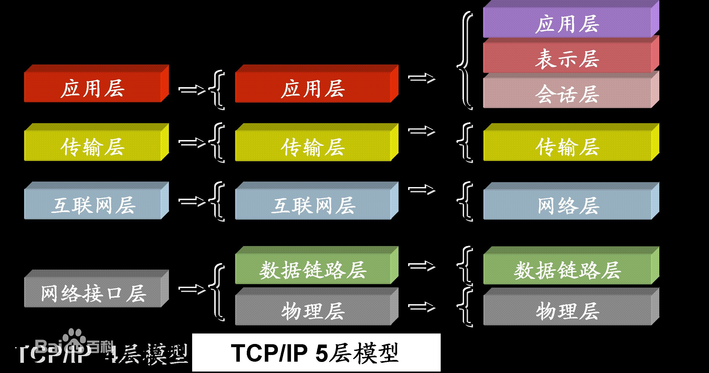
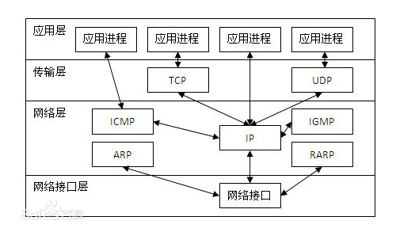

# 网络协议\/抓包

---

## 网络

#### URL

> URL：Uniform Resource Locator 统一资源定位符 。 是资源在网路上的地址，位置，每个资源都有一个唯一的URL

##### URL的组成

> 1.http:\/\/（协议）
> 
> > 协议：规定了资源的查找和传输方式，网络连接要遵循这一协议
> > 
> > 例：http:\/\/iappfree.candou.com:8080\/free\/applications\/limited?currency=rmb&page=3
> 
> 2.iappfree.candou.com
> 
> > 域名或者ip，主机的地址
> > 
> > :8080，端口（可有可无，由服务器开端给开通，默认值是80）
> 
> 3.free\/applications\/limited?
> 
> > 路径，以？结束。资源在主机中的位置。
> 
> 4.currency=rmb&page=3
> 
> > 参数，一般是服务器提出来的，规定参数字段，服务器必须认得这些参数
> > 不能想传啥就传啥
> > 字段名 = 参数值&（以&号分隔多个参数）

#### HTTP协议\(重点掌握\)

##### 概念:

> http：hypertext transfer protocol 超文本传输协议
>          访问远程服务器的最常用协议、特点是简单快捷灵活
>          是基于请 求和响应模式，基于TCP连接的 无状态 应用层协议

##### HTTP协议请求：

```
    1个完整的由客户端发给服务器的HTTP请求中包含以下内容
    请求行：包含了请求方法、请求资源路径、HTTP协议版本
           GET /MJServer/resources/images/1.jpg HTTP/1.1
    请求头：包含了对客户端的环境描述、客户端请求的主机地址等信息
        Host: 192.168.1.105:8080 // 客户端想访问的服务器主机地址
        User-Agent: Mozilla/5.0 (Macintosh; Intel Mac OS X 10.9) Firefox/30.0
        // 客户端的类型，客户端的软件环境
        Accept: text/html, */*// 客户端所能接收的数据类型
        Accept-Language: zh-cn // 客户端的语言环境
        Accept-Encoding: gzip // 客户端支持的数据压缩格式
    请求体：客户端发给服务器的具体数据，比如文件数据
```

##### HTTP协议响应：

```
    1个完整的HTTP响应中包含以下内容：
    状态行：包含了HTTP协议版本、状态码、状态英文名称
        HTTP/1.1 200 OK
    响应头：包含了对服务器的描述、对返回数据的描述
        Server: Apache-Coyote/1.1 // 服务器的类型
        Content-Type: image/jpeg // 返回数据的类型
        Content-Length: 56811 // 返回数据的长度
        Date: Mon, 23 Jun 2014 12:54:52 GMT // 响应的时间
    实体内容：服务器返回给客户端的具体数据，比如文件数据
```

* **请求\(request\):客户端发送给服务器的数据，根据服务器的协议通知给它，让它对数据处理，筛选和分发**

```
        请求行：包含了请求方法、请求路径、HTTP协议的版本
        请求头：包含了客户端的环境描述、客户端请求的主机地址等信息
        请求体：客户端发给服务端的具体数据
```

* **响应\(respond\):服务器接收到请求后回馈响应，包括建立稳定的TCP连接，传输数据**

```
        状态行：包含HTTP协议版本、状态码、状态英文描述
        响应头：包含了对服务器的描述，返回数据的描述
        实体内容：服务器返给客户端的具体数据
```

##### 其它协议

> https: \(HTTPS协议是由SSL\(加密协议\)+HTTP协议构建的可进行加密传输、身份认证的网络协议，比http协议安全。\)
> 
> file：（本地计算机）
> 
> ftp：（访问共享主机的资源文件）

##### 常见的HTTP状态码和短语

> 200 OK：请求成功，信息包含在返回的响应报文中。
> 301 Moved Permanently：请求的对象已经被永久转移了，新的URL定义在响应报文的Location 首部行中指定。客户机可自动用新的URL获取该对象。
> 400 Bad Repuest：一个通用差错代码，指示该请求不能被服务器所理解。
> 403  禁止访问
> 404 Not Found：被请求的文档不在服务器上。
> 505  网关错误
> 505 HTTP Version Not Supported：服务器不支持请求报文使用的HTTP协议版本。
> 206 RANGE: bytes=2000070-    断点续传

#### TCP\/IP






##### 概念:Transmission Control Protocol 传输控制协议; 对应就有UDP  User Data Protocol 用户数据协议。

##### 连接机制：TCP是主机对主机层的传输控制协议，提供可靠的连接服务，采用三次握手确认建立一个连接

```
          位码即tcp标志位,有6种标示:
			SYN(synchronous建立联机) 
			ACK(acknowledgement 确认) 
			PSH(push传送) 
			FIN(finish结束) 
			RST(reset重置) 
			URG(urgent紧急)

		Sequence number(顺序号码) Acknowledge number(确认号码)
```

##### 建立连接三次握手


```
       第一次握手：建立连接时，客户端发送syn包(syn=j)到服务器，并进入SYN_SEND状态，等待服务器确认； 
		第二次握手：服务器收到syn包，必须确认客户的SYN（ack=j+1），同时自己也发送一个SYN包（syn=k），即SYN+ACK包，此时服务器进入SYN_RECV状态； 
		第三次握手：客户端收到服务器的SYN＋ACK包，向服务器发送确认包ACK(ack=k+1)，此包发送完毕，客户端和服务器进入ESTABLISHED状态，完成三次握手。 
		完成三次握手，客户端与服务器开始传送数据.
```

##### 参数的含义：

> syn是建立连接的请求，
> 	seq是序列号即位码，这是为了连接以后传送数据用的，
> 	ack是对收到的数据包的确认，值是等待接收的数据包的序列号。
> 	在第一次消息发送中，A随机选取一个序列号作为自己的初始序号发送给B；第二次消息B使用ack对A的数据包进行确认，因为已经收到了序列号为x的数据包，准备接收序列号为x+1的包，所以ack=x+1，同时B告诉A自己的初始序列号，就是seq=y；第三条消息A告诉B收到了B的确认消息并准备建立连接，A自己此条消息的序列号是x+1，所以seq=x+1，而ack=y+1是表示A正准备接收B序列号为y+1的数据包。

##### 断开连接要四次握手


---

## 抓包软件的使用

